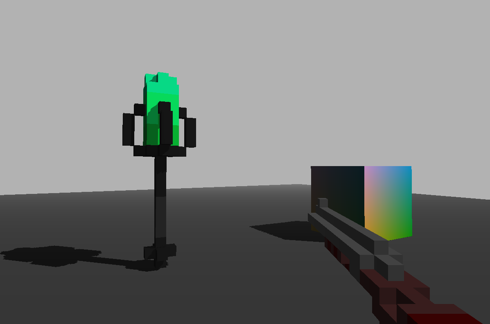

# Basic OpenGL project

## Features

- rendering 3D geometry
- loading textures and model from file
- basic camera movement
- intemediate lighting (normal based and camera based)
- post processing effects
